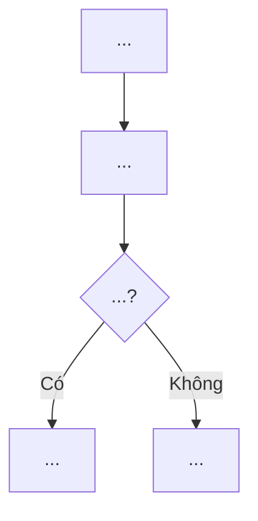
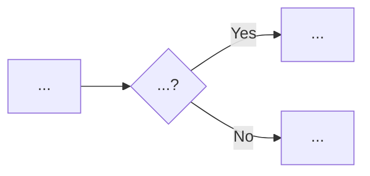

# Generate Document Workflow

## Purpose
Generate a feature documentation plan as an `implementation_plan.md` artifact for user review.
Output covers: overview, main flow (Mermaid), component details, edge cases, test summary, and technical specs.
The plan is saved as a conversation artifact — no `.md` file is written to the project.

## Trigger
`/generate-document <feature_name_or_files>`

---

## Rules
- Language: Vietnamese for all descriptions and content (match project convention)
- Do not modify any code — read-only analysis
- All diagrams must use Mermaid fenced code blocks
- Output must be an `implementation_plan.md` artifact (conversation artifact, NOT a project file)
- Use GitHub-flavored markdown (tables, alerts, mermaid blocks)
- Include ALL edge cases discovered through code analysis
- Cross-reference with existing test-case documents if available
- Sections with no data should be omitted (do not leave empty sections)

---

## Steps

### Phase 1 — Scope Identification

1. **Identify feature scope** from user input:
   - Entry point scripts (controllers, managers)
   - Supporting scripts (services, adapters, helpers)
   - Related popups, UI elements
   - Data models, configs, ScriptableObjects
   - API endpoints involved

2. **Build component map**:
   | Component | Script(s) | Role |
   |-----------|-----------|------|
   | Entry     | ...       | ...  |
   | Service   | ...       | ...  |
   | UI        | ...       | ...  |
   | Data      | ...       | ...  |

### Phase 2 — Deep Analysis

3. **Analyze main flow**:
   - Trace the primary user journey from trigger to completion
   - Identify all async operations, callbacks, events
   - Map state transitions
   - Note timing values, intervals, retry counts

4. **Analyze components**:
   For each component, extract:
   - Properties/configs with actual values from code
   - Behavior rules (when X happens → Y)
   - Dependencies on other components

5. **Identify edge cases**:
   - App lifecycle (kill + reopen, background/foreground)
   - Multi-instance scenarios (e.g., multiple concurrent operations)
   - Race conditions between async channels
   - Network errors and retry behavior
   - Logout / account switch
   - Timeout / TTL expiration
   - Platform-specific behavior (Android vs iOS)

6. **Collect test cases** (if test-case document exists):
   - Cross-reference with existing `/test-case` output
   - Summarize pass/fail/pending counts by group
   - If no test-case document exists, omit section 6

7. **Extract technical specs**:
   - All hardcoded constants, timeouts, intervals
   - Retry counts and policies
   - Data persistence method (PlayerPrefs, file, etc.)
   - API endpoints

### Phase 3 — Document Generation

8. **Generate markdown document** with the following sections:

```
Section 1: Feature overview (summary + mechanism table)
Section 2: Main flow (Mermaid flowchart diagram)
Section 3: Component details (sub-sections with property tables)
Section 4: Edge cases (sub-sections with Mermaid + tables)
Section 5: Test cases summary table (if available)
Section 6: Technical specs table
```

Each section follows these patterns:

#### Section 1 — Feature Overview
- One paragraph describing the feature
- Markdown table with channels/mechanisms involved:
  | Column | Content |
  |--------|---------|
  | Channel/Mechanism | Name |
  | How it works | Brief description |
  | Priority | Primary / Fallback / etc. |

#### Section 2 — Main Flow
- Mermaid `flowchart TD` or `flowchart LR` inside fenced code block
- Cover the happy path + primary fallback
- Use Vietnamese labels in diagram nodes
- Include decision nodes for branching logic

#### Section 3 — Component Details
- One `###` sub-section per component
- Markdown table with properties and their actual values
- Use **bold** for important values (time, retry limits, new features)
- Bullet lists for behavioral rules

#### Section 4 — Edge Cases
- One `###` sub-section per edge case category
- Mermaid diagram (fenced block) if the flow is complex
- Table with case → behavior mapping
- Use GitHub alerts for important notes:
  - `> [!NOTE]` for informational notes
  - `> [!WARNING]` for warnings
  - `> [!TIP]` for confirmed behaviors / best practices

#### Section 5 — Test Cases Summary (optional)
- Summary table:
  | # | Nhóm | Mô tả | Số TC | ✅ | ⬜ |
- Total row at bottom (**bold**)
- `> [!NOTE]` for any pending TCs

#### Section 6 — Technical Specs
- Single table with all constants:
  | Thông số | Giá trị |
- Include units (seconds, minutes, counts)

### Phase 4 — Output

9. **Save as implementation_plan.md artifact**:
   - Write the generated document to `<appDataDir>/brain/<conversation-id>/implementation_plan.md`
   - This is a conversation artifact, NOT a file in the project
   - Use `notify_user` with `PathsToReview` to request user review

10. **Inform user**:
    - Request review of the plan
    - Suggest next steps

---

## Markdown Template

````markdown
# {EMOJI} Feature Document – {FEATURE_NAME}

> **Version:** 1.0 | **Ngày:** {DATE} | **Module:** {MODULE_LIST}

---

## 1. Tổng quan tính năng

{FEATURE_SUMMARY}

| {Column 1} | {Column 2} | {Column 3} |
|-------------|-------------|-------------|
| ...         | ...         | ...         |

---

## 2. Flow chính



---

## 3. Chi tiết các thành phần

### 3.1 {Component Name}

| Thuộc tính | Giá trị |
|------------|---------|
| ...        | **value** |

- Behavioral rule 1
- Behavioral rule 2

### 3.2 {Component Name}
...

---

## 4. Xử lý các trường hợp đặc biệt

### 4.1 {Edge Case Category}



| Trường hợp | Hành vi |
|-------------|---------|
| ...         | ...     |

> [!NOTE]
> Important note about this edge case.

### 4.2 {Edge Case Category}
...

---

## 5. Bảng Test Cases tổng kết

| # | Nhóm | Mô tả | Số TC | ✅ | ⬜ |
|---|------|--------|-------|-----|-----|
| 1 | ...  | ...    | N     | N   |     |
| ...| ... | ...    | ...   | ... | ... |
|   | **TỔNG** |   | **N** | **N** | **N** |

> [!NOTE]
> N TCs remaining require device testing.

---

## 6. Thông số kỹ thuật

| Thông số | Giá trị |
|----------|---------|
| ...      | ...     |

> [!WARNING]
> Important technical note.
````

---

## Placeholders Reference

| Placeholder | Source | Example |
|-------------|--------|---------|
| `{EMOJI}` | Choose relevant emoji for feature | 📹, 🎮, 🔔 |
| `{FEATURE_NAME}` | User input or derived from scripts | Generate Video |
| `{DATE}` | Current date (dd/mm/yyyy) | 27/02/2026 |
| `{MODULE_LIST}` | From Phase 1 component map | FCM Service, VideoStatusPoller |
| `{FEATURE_SUMMARY}` | From Phase 2 analysis | User tạo video từ outfit... |
| `{COLUMN_N}` | Adapt to feature context | Kênh, Cơ chế, Ưu tiên |

---

## Next Steps (MANDATORY OUTPUT)
After generating the plan, ALWAYS output via `notify_user`:

```
## Next Steps
You can:
- Approve → I will save the `.md` file to your project
- `/export-html` — export to HTML with Mermaid rendering
- `/test-case` — generate test cases for this feature
- `/verify-testcase` — verify existing test cases
- Request edits before saving
```
